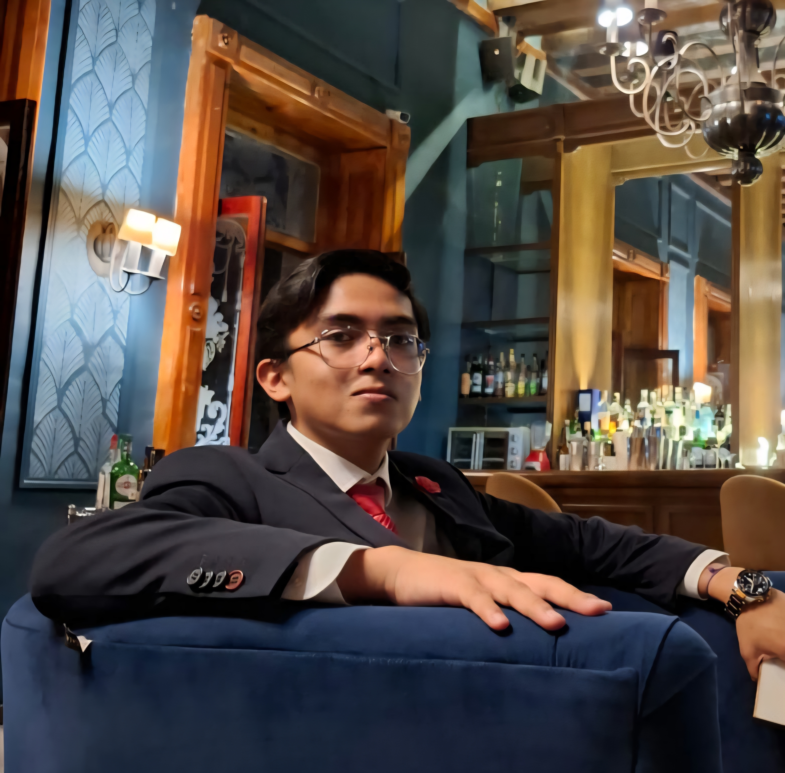

# **Proyecto de Santiago Herrera Conde**
---
Bienvenido  😁

Soy **Santiago Herrera Conde**, estudiante de la Ingenieria en Mecatronica en la **IBERO Puebla**, actualmente curso 1.er semestre.
---

---

**Un poco de mi:**

Me considero alguien creativo y siempre dispuesto a enfretar nuevos retos.

Entre mis gustos se encuentran los deportes como el futbol, el hockey sobre pasto y el boxeo, tambien me gustan mucho los videojuegos especializados en shooters u juegos de simulacion, a su vez tengo una gran pasion por la cocina, estas actividades no solo las disfruto, sino que tambien me ayudan a crecer como persona dia tras dia.

Considero que uno de mis mayores logros ha sido pertenecer al seleccionado estatal del equipo de hockey de Tlaxcala, al igual que haber participado en distintos torneos estatales y nacionales de futbol.

---
Contacto: 201239@iberopuebla.mx
---